# Konexea

A modern social media application built with Flutter, featuring AI-powered interactions and seamless user experience.


## 🌟 Features


- **User Authentication**: Secure login and signup
- **Social Feed**: Dynamic post sharing and interaction
- **Modern UI**: Elegant design with smooth animations
- **AI Chat Assistant**: Intelligent chatbot powered by Gemini AI
- **Messaging**: Realtime chating
- **Integrated E-Commerce**: Integrated marketplace
- **Real-time Updates**: Live feed updates
- **Responsive Design**: Works on all screen sizes

## 📱 Application Preview

### Login Interface

- Modern login UI with unique color combinations
- Loading indicators and animations
- User-friendly input field
- Secure Authentication

### Sign Up Interface

- Modern signup UI with unique color combinations
- Loading indicators and animations
- User-friendly input field
- Secure Authentication

### Feed Interface

- Clean post layout
- Interactive elements
- Smooth scrolling
- Dynamic content loading

### Upload Page Interface

- Minimal Upload Post UI 
- Real-time Response
- Loading indicators and animations
- User-friendly input field

### News Page Interface

- Minimal User Interface
- Real-time Responses
- Loading indicators and animations

### Chat Bot Interface

- Modern chat UI with message bubbles
- Real-time AI responses
- Loading indicators and animations
- User-friendly input field


### Product Hub Interface

- Modern UI interface for the cart and categories
- Real-time Responses
- Loading indicators and animations
  
  ### Profile Page Interface

- Minimal Prpfile Interface
- Smooth Responses
- Loading , saving indicators and animations

## 🛠️ Tech Stack

- **Frontend**: Flutter
- **Backend**: Supabase
- **AI Integration**: Google Gemini AI
- **State Management**: Provider
- **UI Components**: Custom widgets with Material Design 3

## 📦 Installation

1. Clone the repository:
```bash
git clone https://github.com/yourusername/Konexea.git
```

2. Install dependencies:
```bash
flutter pub get
```

3. Set up environment variables:
Update the `consts.dart` file in the root directory with:
```
SUPABASE_URL=your_supabase_url
SUPABASE_ANON_KEY=your_supabase_anon_key
GEMINI_API_KEY=your_gemini_api_key
```

4. Run the application:
```bash
flutter run
```

## 📁 Project Structure

```
├── lib/                     # Main application code
│   ├── Controllers/         # Business logic and services
│   │   ├── Services/
│   │   │   ├── Database/
│   │   │   └── Auth/
│   │   └── Providers/
│   ├── Model/              # Data models
│   ├── Utils/              # Utility functions and constants
│   └── Views/              # UI components
│       ├── Interface/      # Main app screens
│       └── components/     # Reusable widgets
├── assets/                 # Static assets
│   ├── images/            # Image assets
│   ├── categories/        # Category icons
│   ├── carousel/          # Carousel images
│   └── lottie/            # Lottie animations
```

## 🔧 Configuration

### Required Dependencies
```yaml
dependencies:
  flutter:
    sdk: flutter
  # Core
  cupertino_icons: ^1.0.2
  provider: ^6.1.1
  google_fonts: ^6.1.0
  intl: ^0.19.0
  
  # UI Components
  iconsax: ^0.0.8
  shimmer: ^3.0.0
  lottie: ^3.3.1
  curved_navigation_bar: ^1.0.3
  font_awesome_flutter: ^10.7.0
  carousel_slider: ^5.0.0
  cached_network_image: ^3.3.1
  photo_view: ^0.14.0
  
  # Media
  image_picker: ^1.0.7
  video_player: ^2.8.2
  visibility_detector: ^0.4.0+2
  
  # Backend
  firebase_core: ^3.12.1
  cloud_firestore: ^5.6.5
  supabase_flutter: ^2.3.4
  
  # Utilities
  http: ^1.1.0
  fluttertoast: ^8.2.4
  google_mlkit_translation: ^0.13.0```
```
# Social Swap Activity Diagrams

## System Architecture

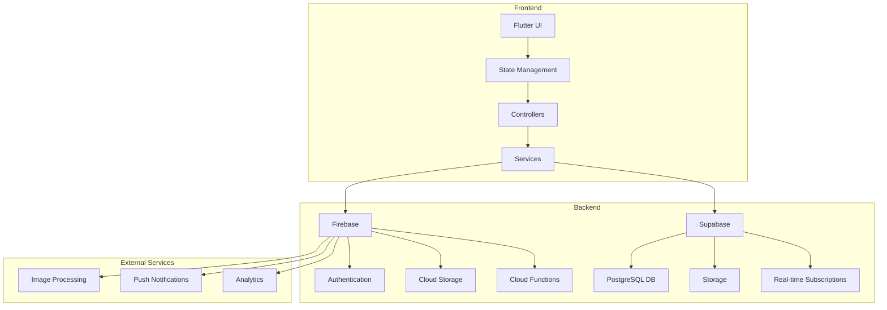

## User Authentication Flow

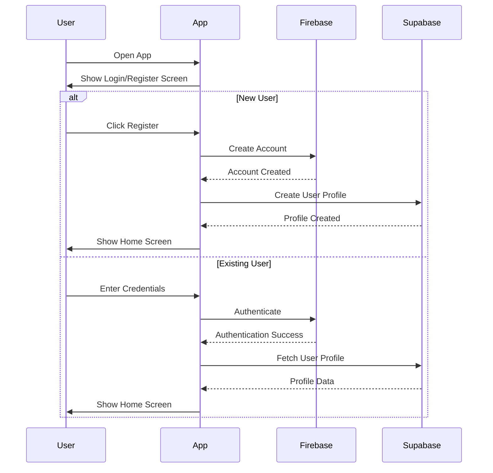

## Post Creation Flow

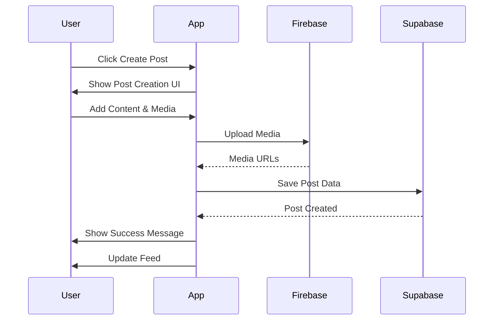

## Social Interaction Flow

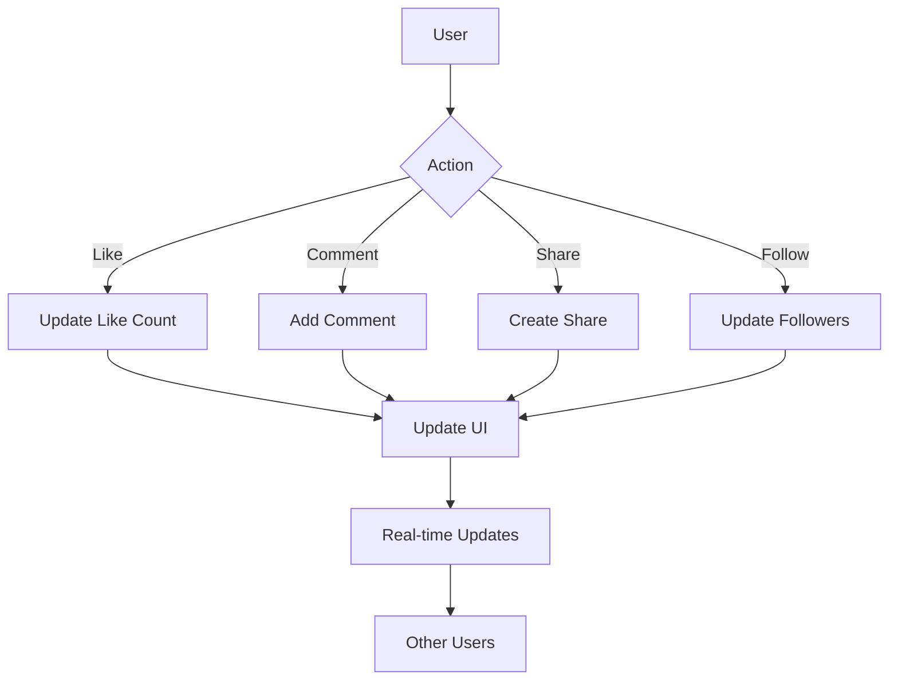

## Content Discovery Flow

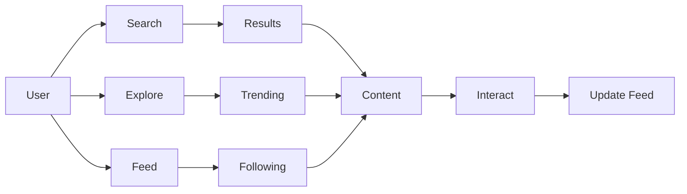

## Data Flow Architecture

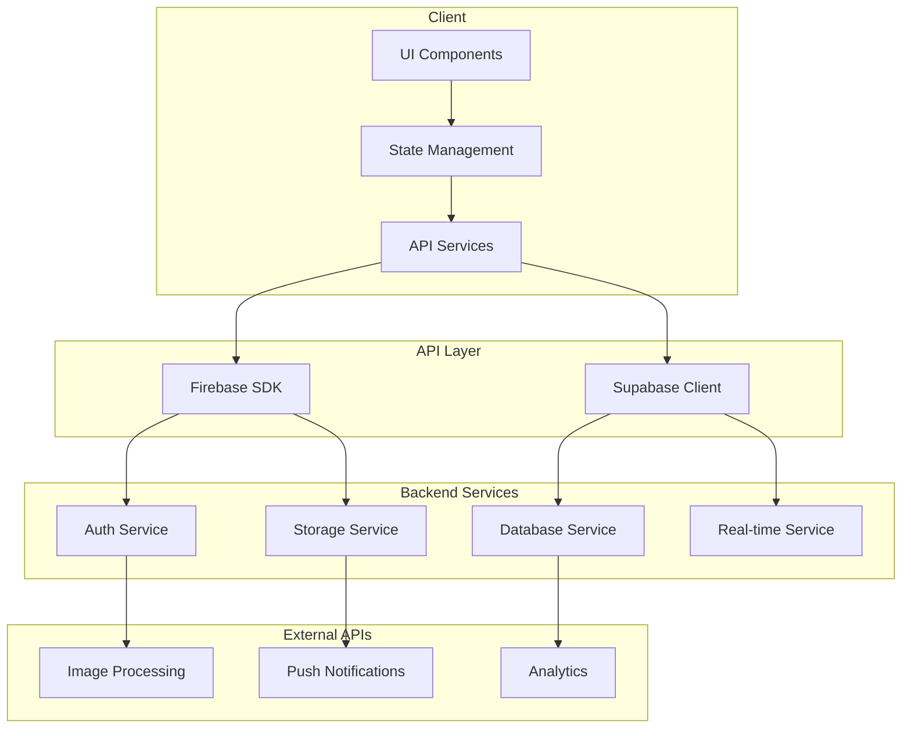

## Class Diagram

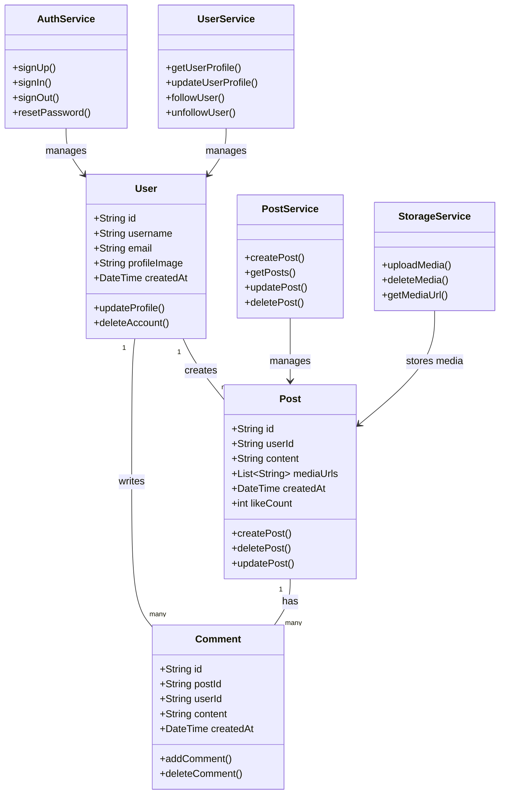

## Detailed Sequence Diagrams

### User Registration Sequence

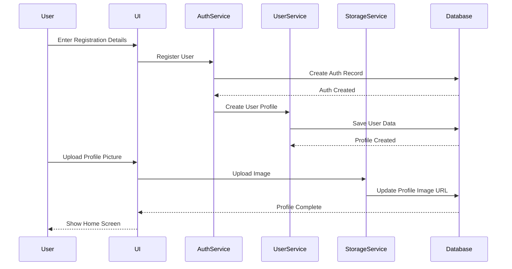

### Post Interaction Sequence

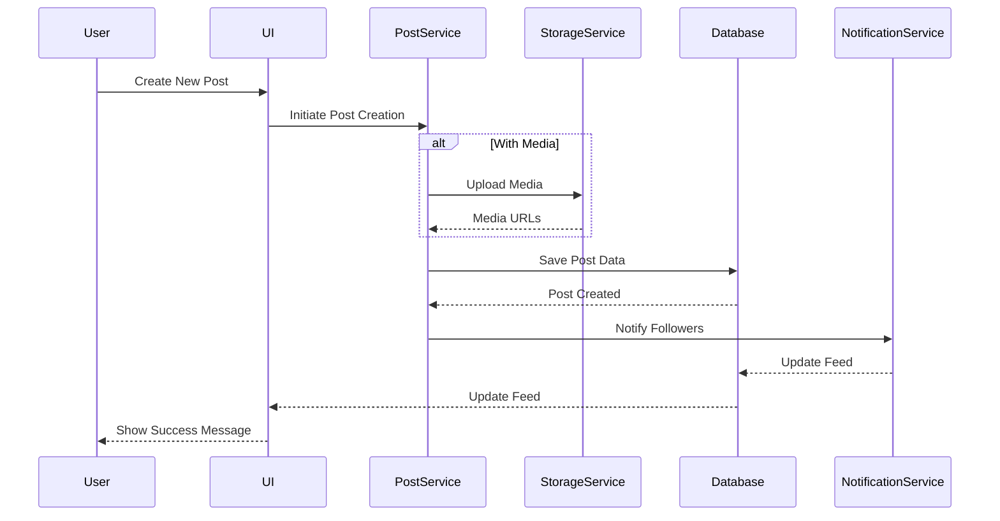

### Social Interaction Sequence

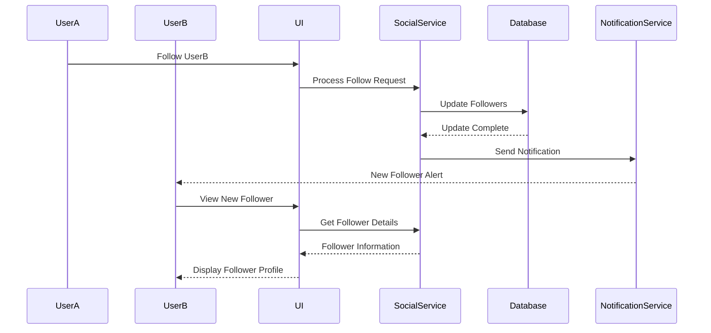

### Content Discovery Sequence

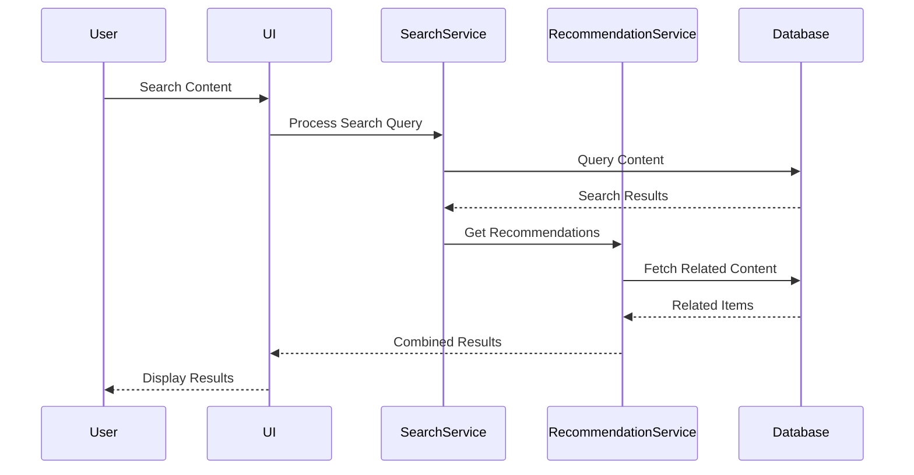

These diagrams provide a comprehensive view of:
1. System Architecture
2. User Authentication Flow
3. Post Creation Process
4. Social Interaction Flow
5. Content Discovery Flow
6. Data Flow Architecture

Each diagram represents different aspects of the application's functionality and can be used as a reference for development and understanding the system's behavior. 

## 🤝 Contributing

1. Fork the repository
2. Create your feature branch (`git checkout -b feature/AmazingFeature`)
3. Commit your changes (`git commit -m 'Add some AmazingFeature'`)
4. Push to the branch (`git push origin feature/AmazingFeature`)
5. Open a Pull Request

## 📄 License

This project is licensed under the MIT License - see the [LICENSE](LICENSE) file for details.

## 👥 Authors

- Mahad Ghauri
- Mahateer Muhammad

## 🙏 Acknowledgments

- Flutter team for the amazing framework
- Supabase for the backend infrastructure
- Google for the Gemini AI API
- All contributors and supporters

## 📞 Support

For support, email mahadghauri222@gmail.com.
For support, email mahateermuhammad100@gmail.com.
