# Konexea

A modern social media application built with Flutter, featuring AI-powered interactions and seamless user experience.


## 📱 Current Version: v1.3.0

### What's New in v1.3.0
- Enhanced UI/UX with improved animations and transitions
- Optimized performance for smoother scrolling and loading
- Added new visualization features for better data representation
- Improved error handling and user feedback
- Bug fixes and stability improvements

## 🌟 Features


- **User Authentication**: Secure login and signup
- **Social Feed**: Dynamic post sharing and interaction
- **Modern UI**: Elegant design with smooth animations
- **AI Chat Assistant**: Intelligent chatbot powered by Gemini AI
- **Messaging**: Realtime chating
- **Integrated E-Commerce**: Integrated marketplace
- **Real-time Updates**: Live feed updates
- **Responsive Design**: Works on all screen sizes

## 🛠️ Tech Stack

- **Frontend**: Flutter
- **Backend**: Supabase
- **AI Integration**: Google Gemini AI
- **State Management**: Provider
- **UI Components**: Custom widgets with Material Design 3

## 📦 Installation

1. Clone the repository:
```bash
git clone https://github.com/yourusername/Konexea.git
```

2. Install dependencies:
```bash
flutter pub get
```

3. Set up environment variables:
Update the `consts.dart` file in the root directory with:
```
SUPABASE_URL=your_supabase_url
SUPABASE_ANON_KEY=your_supabase_anon_key
GEMINI_API_KEY=your_gemini_api_key
```

4. Run the application:
```bash
flutter run
```

## 📁 Project Structure

```
├── lib/                     # Main application code
│   ├── Controllers/         # Business logic and services
│   │   ├── Services/
│   │   │   ├── Database/
│   │   │   └── Auth/
│   │   └── Providers/
│   ├── Model/              # Data models
│   ├── Utils/              # Utility functions and constants
│   └── Views/              # UI components
│       ├── Interface/      # Main app screens
│       └── components/     # Reusable widgets
├── assets/                 # Static assets
│   ├── images/            # Image assets
│   ├── categories/        # Category icons
│   ├── carousel/          # Carousel images
│   └── lottie/            # Lottie animations
```

## 🔧 Configuration

### Required Dependencies
```yaml
dependencies:
  flutter:
    sdk: flutter
  # Core
  cupertino_icons: ^1.0.2
  provider: ^6.1.1
  google_fonts: ^6.1.0
  intl: ^0.19.0
  
  # UI Components
  iconsax: ^0.0.8
  shimmer: ^3.0.0
  lottie: ^3.3.1
  curved_navigation_bar: ^1.0.3
  font_awesome_flutter: ^10.7.0
  carousel_slider: ^5.0.0
  cached_network_image: ^3.3.1
  photo_view: ^0.14.0
  
  # Media
  image_picker: ^1.0.7
  video_player: ^2.8.2
  visibility_detector: ^0.4.0+2
  
  # Backend
  firebase_core: ^3.12.1
  cloud_firestore: ^5.6.5
  supabase_flutter: ^2.3.4
  
  # Utilities
  http: ^1.1.0
  fluttertoast: ^8.2.4
  google_mlkit_translation: ^0.13.0
```


# Konexea Project Visualization

## Project Architecture Overview

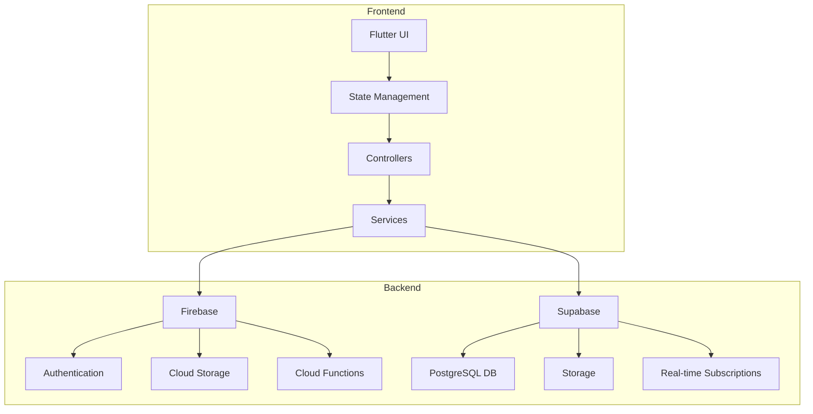

## Development Workflow

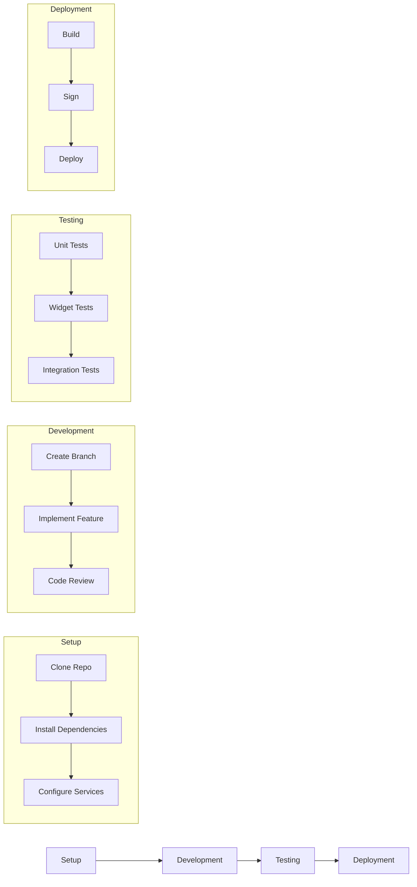

## Feature Implementation Flow

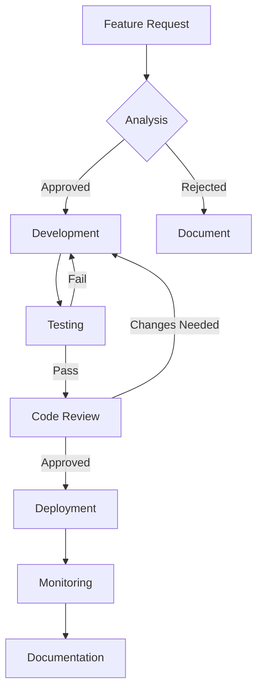

## Project Structure

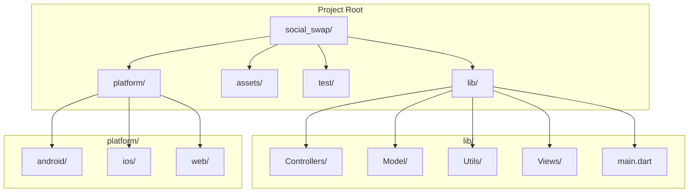

## State Management Flow

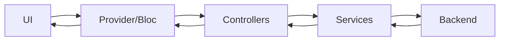

## Testing Strategy

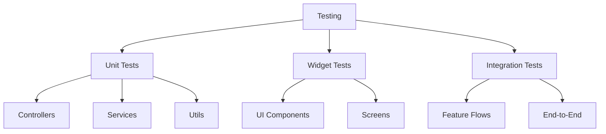

## Deployment Pipeline

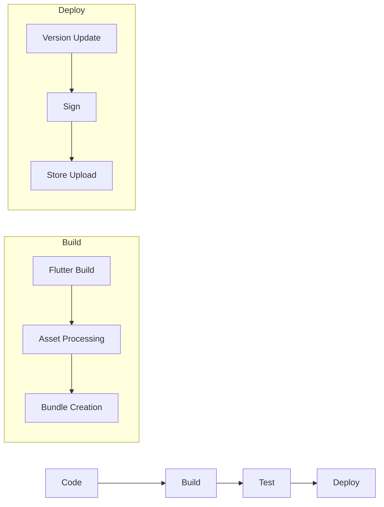

## Security Flow

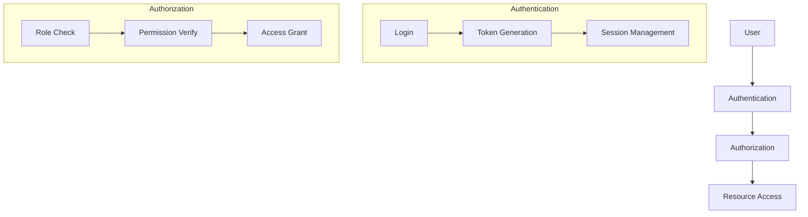

## Error Handling Flow

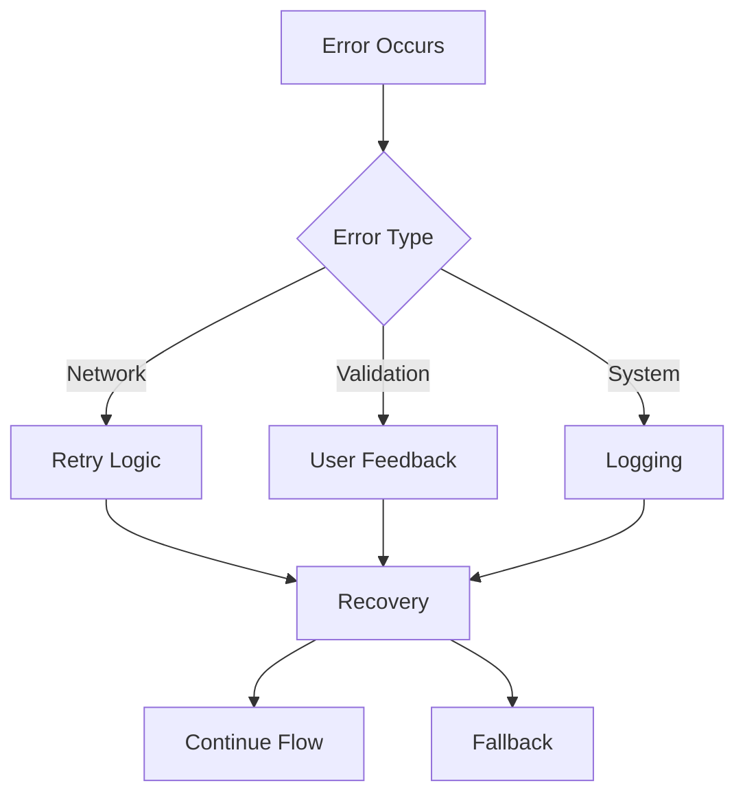

# Konexea Class Diagram


## Class Diagram

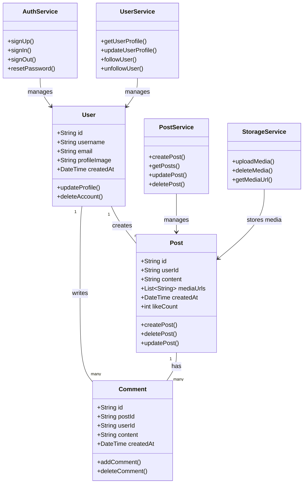


# Konexea Activity Diagrams

## System Architecture

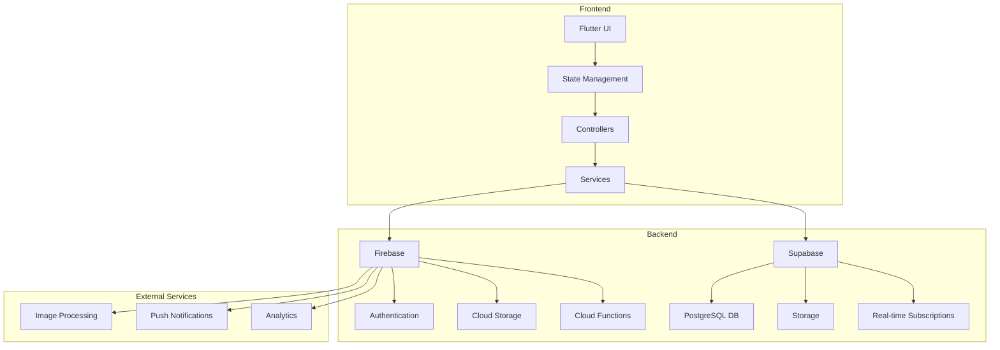

## User Authentication Flow

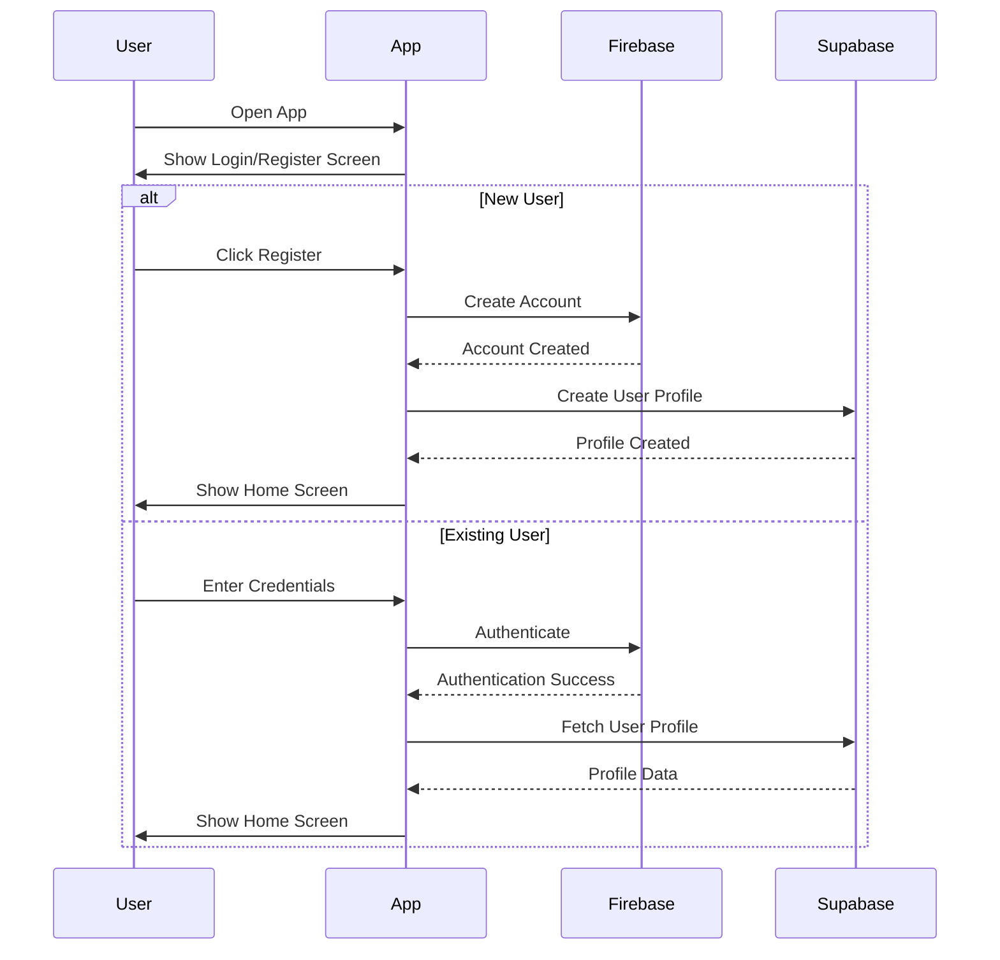

## Post Creation Flow

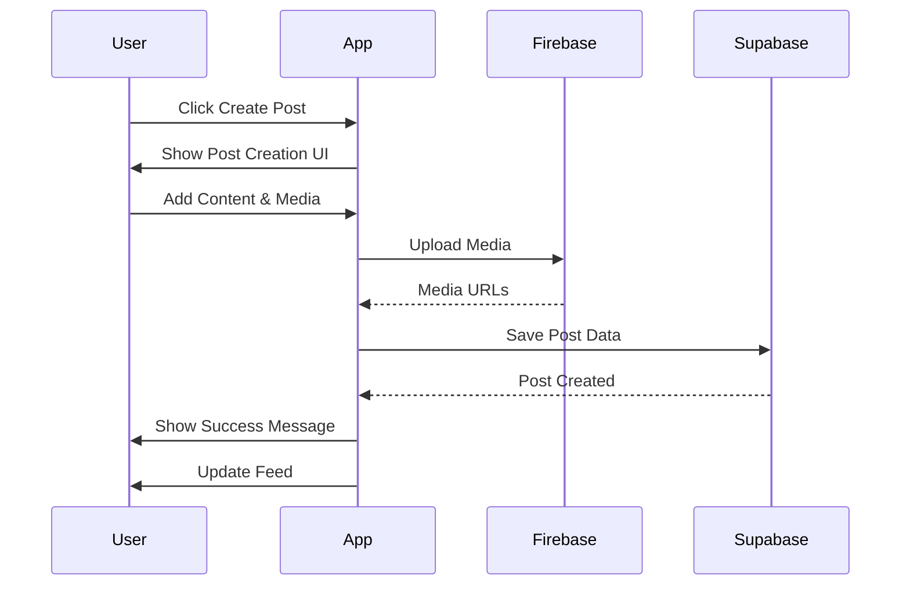

## Social Interaction Flow

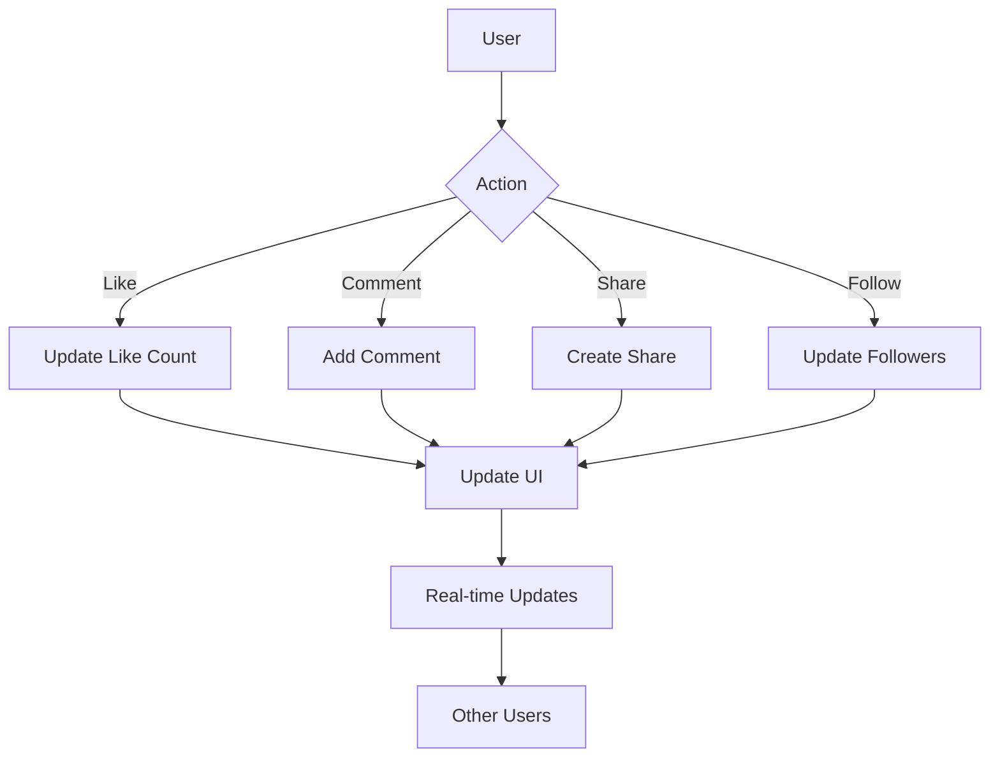

## Content Discovery Flow

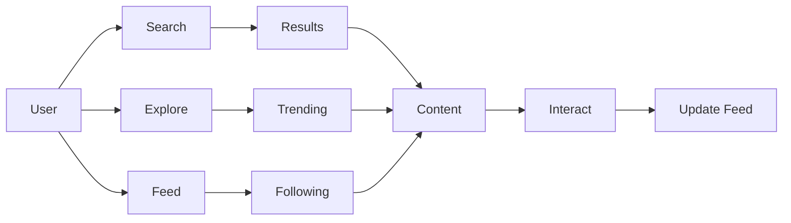

## Data Flow Architecture

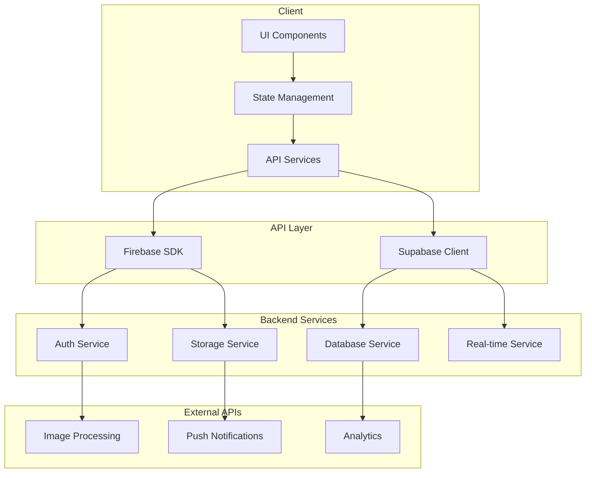
## Detailed Sequence Diagrams

### User Registration Sequence

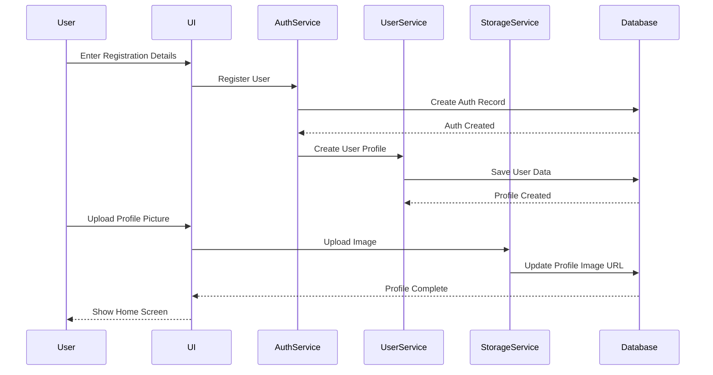

### Post Interaction Sequence

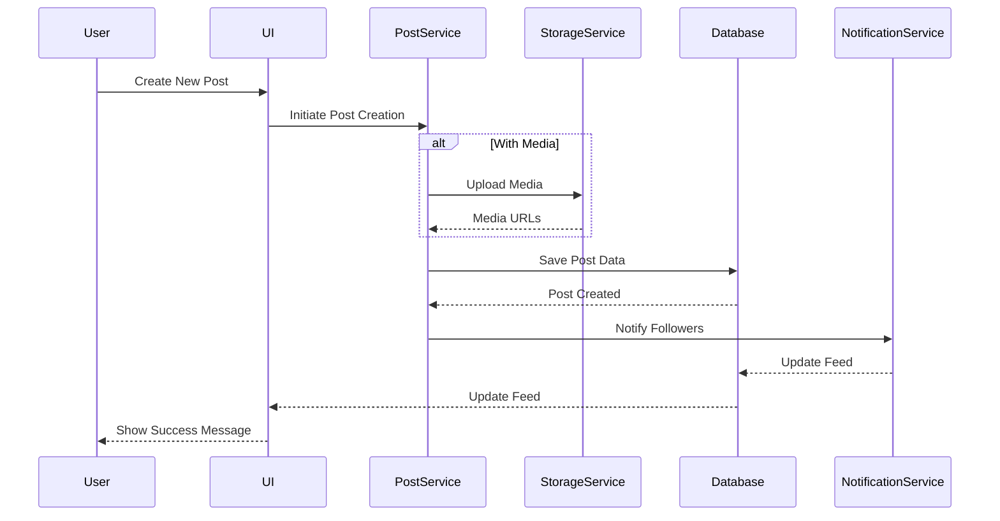

### Social Interaction Sequence

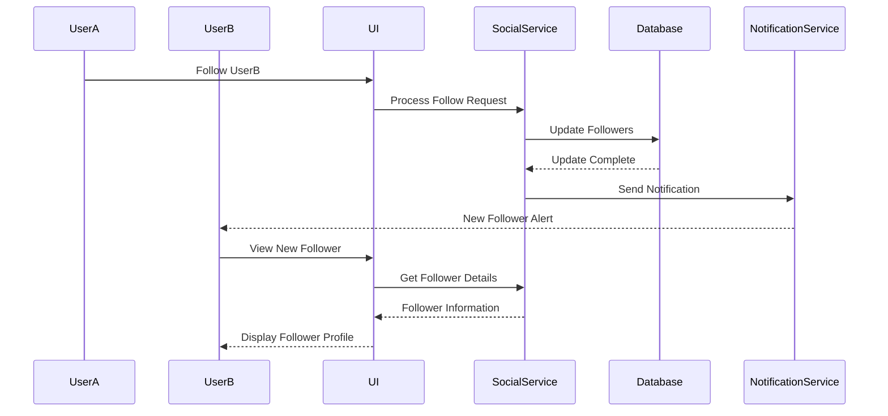

### Content Discovery Sequence

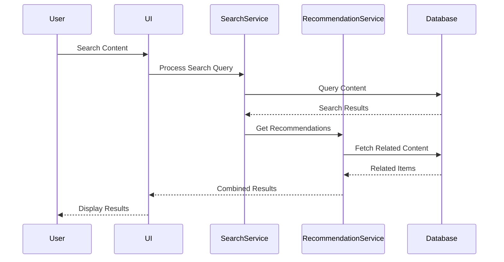


## 🤝 Contributing

1. Fork the repository
2. Create your feature branch (`git checkout -b feature/AmazingFeature`)
3. Commit your changes (`git commit -m 'Add some AmazingFeature'`)
4. Push to the branch (`git push origin feature/AmazingFeature`)
5. Open a Pull Request

## 📄 License

This project is licensed under the MIT License - see the [LICENSE](LICENSE) file for details.

## 👥 Authors

- Mahad Ghauri
- Mahateer Muhammad

## 🙏 Acknowledgments

- Flutter team for the amazing framework
- Supabase for the backend infrastructure
- Google for the Gemini AI API
- All contributors and supporters

## 📞 Support

For support, email mahadghauri222@gmail.com.
For support, email mahateermuhammad100@gmail.com.
